# DDR Soft Pad Modification

This is a backup of the original Angelfire website: [DDR Soft Pad Modification By Penguinlord](https://www.angelfire.com/pro2/softpadmod/) that outlines how to modify a Dance Dance Revolution soft pad to become more resilient and prolong life of the pad. I am backing this up in it's original form incase for some reason Angelfire goes down. This is an essential guide that I have used several times for DDR.

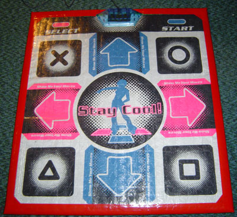

## Contents

* [Introduction](#introduction)
* [Supplies](#supplies)
* [Before Starting](#before-starting)
* [Cutting Up The Vinyl](#cutting-up-the-vinyl)
* [Setting Up The Board](#setting-up-the-board)
* [Attaching The Bumps](#attaching-the-bumps)
* [Carpet Tape Time](#carpet-tape-time)
* [Covering The Pad](#covering-the-pad)
* [All The Trimmings](#all-the-trimmings)

### Introduction
 

I’m writing this because the guides to modifying a DDR soft pad seem to be somewhat lacking on the internet. The pads that are being demonstrated in this guide are not much different than TommyGun’s pads, pictures of which are available at http://www.extremespin.com/tommy/ddr/. I found his instructions to be rather vague, so I’m going to write my own which will hopefully be more clear and helpful to who want to modify their first pad.

Why modify a soft pad? Many people will tell you it prolongs the life of the pad, which is always a good thing, but my primary reason is to make the soft pad more stable and easier to dance on. A modified pad slips infinitely less than just a regular pad, which gives you a huge edge in playing. No more crumpled up pads sliding around making you lose your place.

This guide can not fully describe what it takes to modify a pad. The only way to learn how to do it is just to do it. I suggest reading the whole guide before you start so that you don’t run into something you didn’t expect. Feel free to make changes, do things differently or not at all. It’s your pad, build it the way you want it!

### Supplies
 
My favorite soft pad is the DPR2 by Naki (www.nakiusa.com). I buy them at GameStop in my local mall for $20. They’re thick and comfortable, and they have little LEDs at the top telling you when you’re pressing a button, which can be helpful if you think something is going wrong with your pad. I’ve never had a problem with them, but I haven’t used a single one for a very extended period of time yet. It’s basically your call which kind of pad you want to use, pretty much any non-deluxe style soft pad will work.

After getting the pad, you will need the following supplies, all of which are available at Home Depot:

* A board 35 inches wide by 39 inches tall * ($24).
* A roll of duct tape of your favorite color ($5).
* A roll of double sided carpet tape ($5).
* A roll of clear packaging tape ($5).
* 10 feet of hardwood floor covering ** ($15).
 
Things that hopefully you already own or can borrow:

* A pretty heavy-duty staple gun.
* A hammer to hammer in the staples all the way, unless you’re really good at stapling.
* Scissors that can cut the hardwood floor covering.
* Tape measure, ruler, some kind of measuring device.
* A pencil to mark the wood with.

This is what is required to build a single pad. If you’re building two pads, then you can skimp a bit by only buying one roll of carpet tape and one roll of clear tape, and you might be able to get away with only one roll of duct tape.

**Some notes:**

* The boards at Home Depot only come in 4 by 8 foot sheets, which is enough for two DDR pads. My suggestion, if you’re only building one pad, is to get them to cut two boards anyway, and save the other one in case you decide to build a second. The boards I got are 5/8ths of an inch thick, which is pretty heavy, but you want to be sure that it isn’t going to break in half if you jump too hard.

* Hardwood floor covering (listed on the receipt as “Vinyl Runner”) is thick plastic that you’re going to use to cover your soft pad. It’s located near to the flooring section of Home Depot, on these big rollers. When I went, the only thing that was suitable had this silly pattern on it which you might be able to see in the pictures. At first I was a bit disgruntled about it, but it ended up being kind of cool-looking when the pad was finished (and it gives you some traction too). So if you can find clear covering without a pattern, go for it, but if not, don’t fret about it. Get a sales associate to cut you 10 feet of it (per pad).

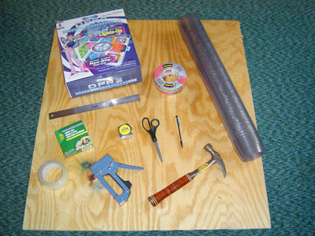

### Before Starting

Test your pad to make sure it works! True story: During the making of this guide, I boarded, taped, vinyled, and stapled a pad all up, tested it... and it was freaking out. Whenever I pressed the left arrow, it would register me pressing left, down, up-left, and select! Not cool. I actually had to cut the pad open, figure out where the wires were crossing and tape it up so they wouldn’t touch anymore, and it was all a big mess. The moral of the story: plug your pad in when you get it out of the box and just make sure all the buttons are doing what they’re supposed to. You can never be too careful. And as a side note, if you’ve never seen the inside of a soft pad, I recommend that you do so sometime. It’s very interesting.

Onward!

### Cutting Up The Vinyl
 
The vinyl hardwood floor covering is used for two things: to cover the pad for protection and security, and raised “bumps” under the arrows that will help you to feel around the board when you’re dancing. If you’ve ever used a deluxe-style pad, you’ll know what I’m talking about. They’re very helpful, and once you’ve danced with them, you’ll never want to go back to a flat pad.

So you have an ten-foot length of vinyl. If the kind you bought was anything like mine, it will be a little over two feet wide, which is not nearly enough to fully cover a DDR pad in either direction. So we’re going to have to cut two lengths, which will be put across the board horizontally, and then taped together (this works surprisingly well, trust me).

The vinyl is probably rolled up and wants to stay that way, so roll it up backwards and hold it for a few seconds to get it to flatten out a bit, which makes it much easier to work with. Place it horizontally across the board and cut a length that has about two inches extra on either side of the board. Any more extra than this is a waste, because you’re just going to cut it off. For reference, the strips I cut were 39 inches long (35 inch wide board + 2 inches extra on each side). Measure and cut a second length of vinyl.

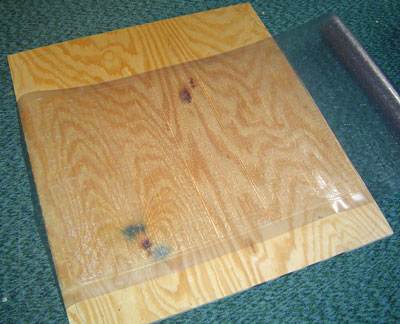

Set the two strips of vinyl horizontally across the board so that they overlap a bit in the middle. Personally, I don’t like the feel of the overlap in the center of the board, but if you don’t mind it, it makes things a lot easier. Just tape them together with clear packaging tape, making sure that you use one long piece across the top so that there are no corners to peel up while you dance on it. If you do mind the overlap, you’re going to have to lay the two edges together and tape a bit more carefully. I recommend that you tape the bottom first, using short strips to tape vertically to hold it together, and then long pieces horizontally to finish the job. The top only needs a single long piece, because the bottom tape should hold it together well enough.

The back taping:   
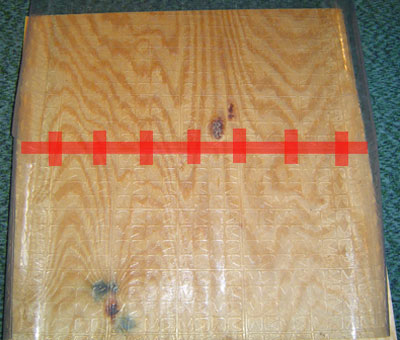

The back taping:
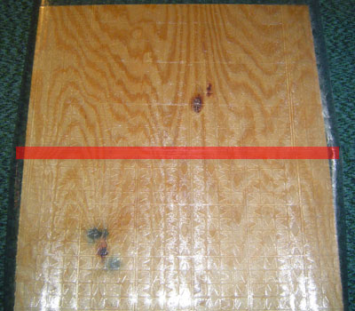
                    
(those are Photoshopped lines, it’s not actually the color of my tape)

With that, you’re done with the top cover for now. Set it aside until later.

With the remaining 3 1/2 feet of vinyl, you should be able to cut 8 squares that are 9 inches by 11 inches. Putting two of these together provides a subtle but helpful bump underneath each arrow. If you find that the bump is too subtle (and it may very well be), you can try three squares under each, but that would require more vinyl to begin with. Set the squares aside until after the next section.

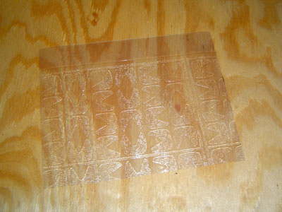
 
### Setting Up The Board
 
Take the DDR pad out of the box, unfold it and flatten it out as best you can. It would be best if you could lay it out and put the board on top of it for a while, so that it will lie perfectly flat when you’re building your pad. I highly recommend doing this, because you don’t want your measurements to be off or it’s going to result in something weird and unpleasant.

Once you’ve got your pad all nice and flattened out, put it on top of the board, centered as much as possible on the board. If you’re using a DPR2, don’t center it based on the blue control box at the top, that is very often not attached exactly center on the pad. Center it based on the sides of the pad versus the sides of the board. The important part is to get the arrows as straight as possible with respect to the board. When you get it aligned, use a pencil to trace lines around each corner, and also along the top of the control box, that way if the pad slips while you’re building it, you can put it back right where it used to be.

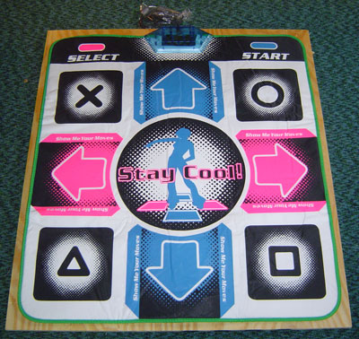
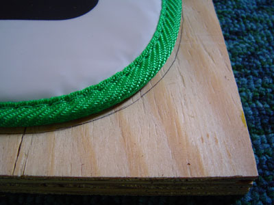

### Attaching The Bumps
 
Now here comes a somewhat difficult part. You need to get the bumps aligned underneath the arrows and attached to the board. The way I did it was to leave the pad on the board, and slide two vinyl squares underneath the arrow, and feel around until it’s in the right place. Then lift the pad while being careful not to move the squares, and duct tape them down. If you have some old crappy duct tape somewhere around your house, use that, and save the nice colored duct tape for the outside, but you’ll probably have enough either way, so it doesn’t really matter. When you’re done taping the squares down, make sure you put the pad back down exactly where it was (use the guides you drew), so that the first arrow isn’t different when you put down the next one, and so on for all four arrows.

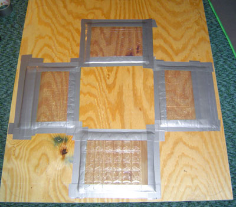

They don’t look very straight in my picture, and I’m sure you can do a better job than I did, but in the end it doesn’t really matter, as long as they’re pretty close to the arrows, your feet won’t really be able to tell the difference.

### Carpet Tape Time

Now it’s time to tape the pad down to the board. This is somewhat of an involved process. The thing to keep in mind while you do it is that you want the pad to be as stretched out as possible. On the DPR2, the bottom foam is a bit bigger than the top sheet, which means if you do it wrong, you’ll have a big wrinkle underneath your pad when it’s done, and it’ll feel weird and annoying.

Start with the bottom arrow and work your way up, taping as you go. Put carpet tape down on the wood, around the arrow.

I highly suggest not putting carpet tape under the arrow itself, because dancing on it will fuse the tape and the foam under the pad very, very strongly, and if you ever choose to take your soft pad off the wood later, trying to take the tape off will more than likely rip a huge hole in the foam (it’s happened to me).

Once you tape the bottom edge down, do the center (I forgot to take a picture, but it’s just four strips in the center, avoiding the very middle where you stand a lot), and then move to the top. Be sure to pull the pad and kind of “roll” it down onto the tape, instead of just putting it down flat, which will result in wrinkles.

The bottom arrow:   
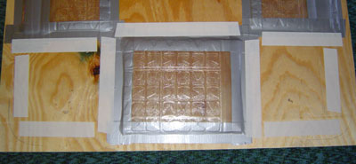

The top arrow:
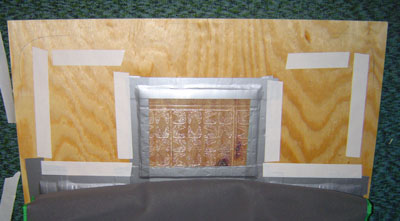
                                

When you’ve got it taped all the way down, walk on it a little bit just to make sure that the arrows still match up to the bumps and there’s no annoying wrinkles in the bottom foam. The carpet tape is probably secure enough to let you play a song, just to give it a try (but be careful not to go crazy and rip the pad off the tape), because after the next step there’s no going back without ruining your vinyl cover.

### Covering The Pad
 
Now it’s time to whip out the staple gun. This step is also a bit tricky, because if your vinyl is like mine, then it’s pretty thick and difficult to manage, and still wants to curl up at the edges. While you’re doing this, be sure not to tear the packaging tape that’s holding the two pieces of vinyl together.

First cut up some little bits of duct tape to hold the vinyl to the wood while you staple it.

Set the board up on its edge, and drape the vinyl over the edge with just enough hanging over to staple it down. You want to staple to the side of the board, not the bottom, because there’s no way the vinyl will folder over all the way underneath the pad. You don’t have too much room to work with it, but the closer you get it to the edge, the less you’ll have to cut off later.

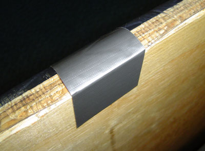
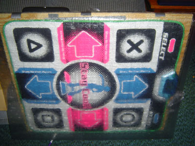

Once it’s secured well enough, you can start stapling it down every couple of inches. If they don’t go in all the way, use a hammer to bang them in.

Flip the board over. Pull the vinyl as tight as you can and staple it down while holding it in place. Put a staple in the middle first, then near the edges, and then put some in the middle. Make sure that it’s evenly taught in all places. It’s difficult to work with the vinyl, and taping it down doesn’t really work because when you pull it tight, the tape isn’t strong enough to hold it and it will unstick. Just staple it while you’re pulling it and it will hold.

Now trim the extra vinyl off the edge, getting it as close as you can. You don’t want the vinyl to wrap all the way around the edge of the board, just down the side, so it looks like the first edge.

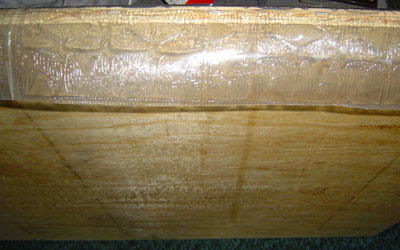
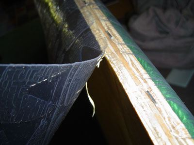

Cut small notches in the bottom corners of the vinyl so the bottom will fold over nicely, and then staple that down in the same fashion as you did the second side of the board, then trim the edge.

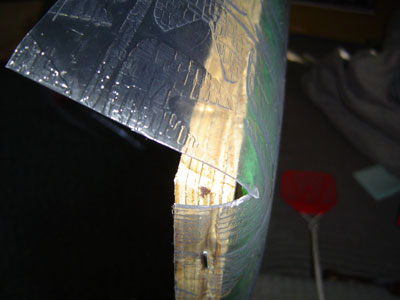
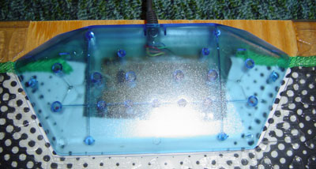
 
Move to the top of the board. Cut out a space for the blue control box at the top of the pad, and cut notches in the corners again, then fold over, staple and trim.

Stand back and appreciate your pad for a few minutes. Play a song or two to make sure that everything is working properly (see above anecdote about what happened to me).

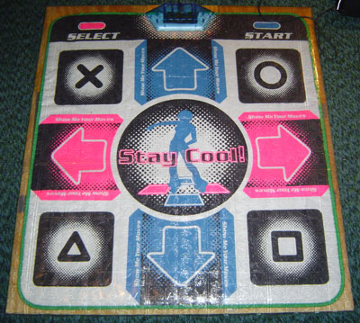

### All The Trimmings
 
Bust out your duct tape. Hopefully you got a nice color (mine is red). Cut lots of short little strips and tape down the bulges in the vinyl between the staples that appear along all four edges. Make sure that none of the strips go past the green border of your pad in the front. Tear some small strips in half to tape down the corners, then tape longer strips down the sides, about half of the tape on each edge. Do your best to tape around the edge of the control box. Use clear packaging tape on the bottom of the control box if you want, or colored duct tape works just the same.

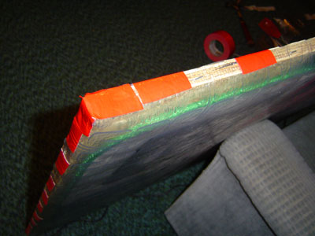
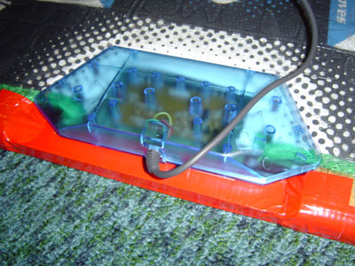
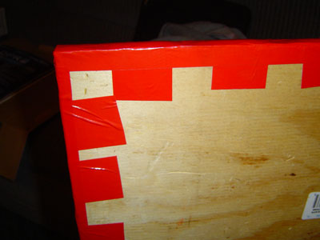
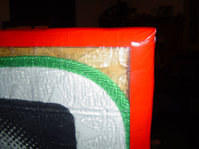

Flip the board over and put long strips of tape on all the bottom edges. Only use one long strip per edge, to minimize the number of places the tape can start coming up. Do the same to the front, so that the tape just covers the green border of the pad so you can’t see it anymore. As one final touch, tape the corners diagonally.

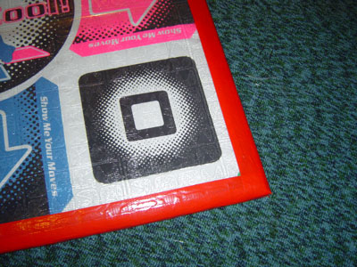
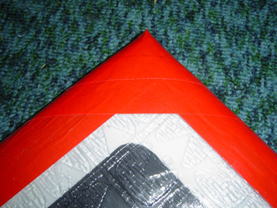

### Conclusion
 
And you’re done! I hope this guide was helpful to you. It certainly was enlightening for me to write, and I hope it helps first-time modders out a little bit.

Happy dancing!

v1.0
Last updated May 5, 2004.
